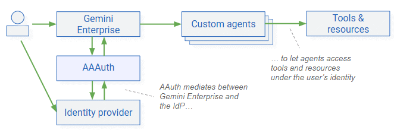
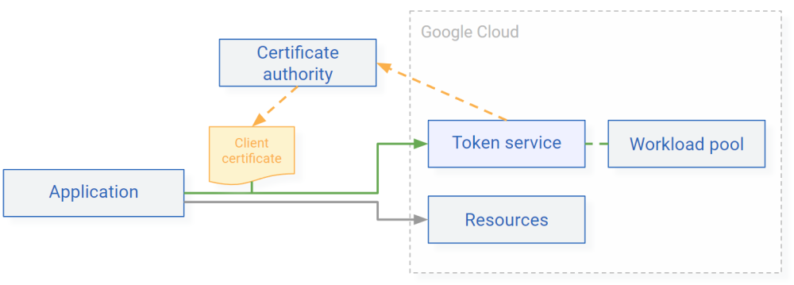
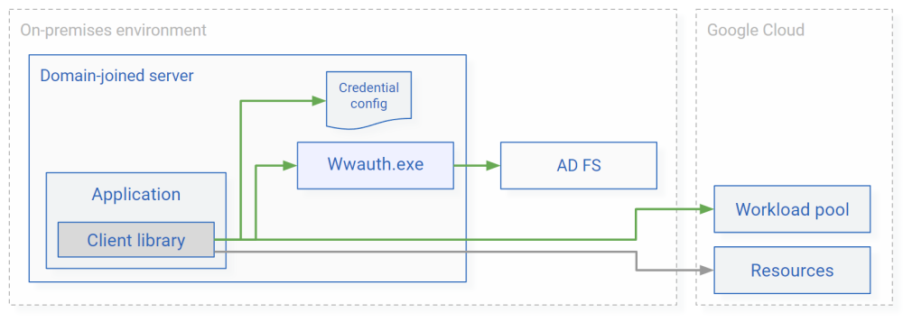

# IAM federation tools

The [`iam-federation-tools`](https://github.com/GoogleCloudPlatform/iam-federation-tools/) repository 
contains a collection of open-source tools that let you use 
federated authentication between Google Cloud and external identity providers.

## AI Agent Authenticator

[{ align=right width="350" }](aaauth.md)

The [AI Agent Authenticator (AAAuth)](aaauth.md) enables delegated authentication 
between [Gemini Enterprise and custom ADK or A2A agents](https://docs.cloud.google.com/gemini/enterprise/docs/agents-overview)
by acting as an intermediary between Gemini Enterprise and your identity provider.

## Token Service

[{ align=right width="350" }](token-service.md)
The [Token Service](token-service.md) is an example implementation of a token broker 
that lets IoT devices and on-premises workloads authenticate 
to Google Cloud using credentials that workload identity federation doesn't support natively.

## Workload Authenticator for Windows

[Workload Authenticator for Windows (WWAuth)](wwauth.md) lets Windows applications authenticate to Google Cloud using their 
Active Directory Kerberos credentials. 

[{ align=right width="350" }](wwauth.md)

The tool works by chaining two token exchanges:

1.  First, WWAuth uses an application's Kerberos credentials to authenticate to
    Active Directory Federation Services and obtain a SAML assertion or OAuth access token.
2.  Second, it uses the AD FS-issued SAML assertion or OAuth access token and
    exchanges it against short-lived Google credentials by using workload identity federation.
    
Using WWAuth is an alternative to using service account keys
and doesn't require you to manage and store any secrets or keys.