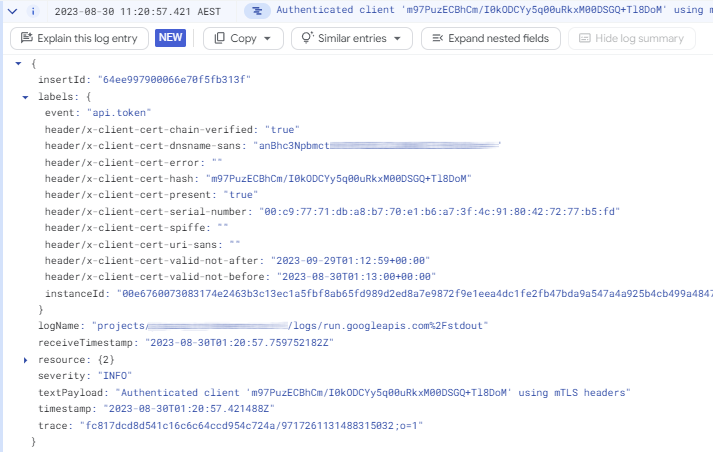
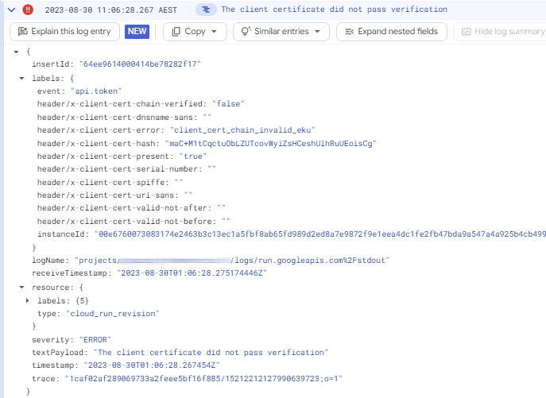

# Authenticate workloads using mutual TLS

The following sections contain examples for how workloads can authenticate to the
token broker using mutual TLS (mTLS) and obtain short-lived Google credentials.

!!! note
    If you're using a proxy server, make sure that the proxy server isn’t intercepting 
    TLS for connections to the Token-Service application. 

## Authenticate programmatically

The following section describes how you can use `curl` or PowerShell to
authenticate to the token service and obtain ID tokens, 
[STS tokens, or service account access tokens :octicons-link-external-16:](https://jpassing.com/2023/01/24/all-google-access-tokens-are-not-created-equal/).

### ID token

To obtain an ID token, perform an HTTP request to the Token-Service and authenticate using an mTLS certificate:
 
=== "Windows"
 
    Use the following PowerShell command to perform an HTTP request and authenticate 
    using a certificate from your personal certificate store: 
 
        $Hash = "CERT_HASH"
        $Certificate = Get-ChildItem Cert:\CurrentUser\My\$Hash

        Invoke-RestMethod `
          -Uri "https://PUBLIC_FQDN/token" `
          -Method POST `
          -Certificate $Certificate `
          -Body @{
            "grant_type"="client_credentials"
          } 
        
    Replace the following:

    *   `CERT_HASH`: the certificate thumbprint of a certificate in your personal certificate store.
    *   `PUBLIC_FQDN`: the public FQDN of the load balancer
    
    
    !!! note
        You must run these steps on a device or computer that has a valid client certificate.

    

=== "Linux"
    
    Use the following `curl` command to perform an HTTP request and authenticate 
    using a certificate and private key file: 
     
        curl "https://PUBLIC_FQDN/token" \
          --data "grant_type=client_credentials" \
          --cert ./user.cer \
          --key ./user.key \
          --verbose | jq

    Replace the following:

    *   `PUBLIC_FQDN`: the public FQDN of the load balancer

The response contains an ID token that asserts the client's identity. Optionally, 
you can use a tool such as [jwt.ms :octicons-link-external-16:](https://jwt.ms/) to decode the ID token:

    {
      "alg": "RS256",
      "kid": "802a626eb50f0bd8d16c0539185b0961f9d88db6",
      "typ": "JWT"
    }.{
      "aud": "https://iam.googleapis.com/projects/PROJECT_NUMBER/locations/global/workloadIdentityPools/POOL/providers/PROVIDER",
      "exp": 1693358537,
      "iat": 1693358237,
      "iss": "https://token-service.example.net",
      "jti": "32769b20-c779-492a-b7cc-81462a298cdc",
      "amr": [
        "xlb-mtls-client-credentials"
      ],
      "client_id": "m97PuzECBhCm/I0kODCYy5q00uRkxM00DSGQ+Tl8DoM",
      "client": {
        "x5_spiffe": "",
        "x5_dnssan": "client.example.net",
        "x5_serial": "00:c9:77:71:db:a8:b7:70:e1:b6:a7:3f:4c:91:80:42:72:77:b5:fd",
        "x5_urisan": "",
        "x5_sha256": "m97PuzECBhCm/I0kODCYy5q00uRkxM00DSGQ+Tl8DoM"
      }
    }.[Signature]
    
The ID token contains the following claims:
    
*   `kid`: the key ID from the service account's JSON Web Ket Sey (JWKS) that was used to sign the token.
*   `aud`: the URL of the workload identity pool.
*   `iss`: the public FQDN of the token service.
*   `jti`: a random ID.
*   `amr`: the authentication flow used by the client.
*   `client_id`: the client ID, determined based on the [`MTLS_HEADER_CLIENT_ID` configuration option](token-service-configuration.md).
    In the default configuration, this corresponds to the base64-encoded SHA-256 certificate thumbprint.
*   `client`: details about the certificate that was used to authenticate the client.

If the response contains an error message, you can find more detailed error information [in the logs](#diagnose-errors).
    
You can now use the ID token and exchange it against a Google STS token by using The
[STS `token`:octicons-link-external-16:](https://cloud.google.com/iam/docs/reference/sts/rest/v1beta/TopLevel/token) API.
Alternatively, you can let the token service perform this token exchange for you.
    
### STS token

You can request an ID token and STS token in a single step by passing an extra parameter:

*   `scope`: the OAuth 2.0 scopes to include in the resulting STS token.

For example:

=== "Windows"
 
    Use the following PowerShell command to perform an HTTP request and authenticate 
    using a certificate from your personal certificate store: 
 
        $Hash = "CERT_HASH"
        $Certificate = Get-ChildItem Cert:\CurrentUser\My\$Hash

        Invoke-RestMethod `
          -Uri "https://PUBLIC_FQDN/token" `
          -Method POST `
          -Certificate $Certificate `
          -Body @{
            "grant_type"="client_credentials"
            "scope"="https://www.googleapis.com/auth/cloud-platform"
          } 
        
    Replace the following:

    *   `CERT_HASH`: the certificate thumbprint of a certificate in your personal certificate store.
    *   `PUBLIC_FQDN`: the public FQDN of the load balancer

=== "Linux"
    
    Use the following `curl` command to perform an HTTP request and authenticate 
    using a certificate and private key file: 
     
        curl "https://PUBLIC_FQDN/token" \
          --data "grant_type=client_credentials" \
          --data "scope=https://www.googleapis.com/auth/cloud-platform" \
          --cert ./user.cer \
          --key ./user.key \
          --verbose | jq

    Replace the following:

    *   `PUBLIC_FQDN`: the public FQDN of the load balancer

The response contains an ID token and an STS token. The STS token is issued
for the following principal:

*   `principal://iam.googleapis.com/projects/PROJECT_NUMBER/locations/global/workloadIdentityPools/POOL_ID/subject/CLIENT_ID`

Where:

*   `PROJECT_NUMBER`: the project number of the project that contains the workload identity pool.
*   `POOL_ID`: the ID of the workload identity pool.
*   `CLIENT_ID`: the client ID, determined based on the [`MTLS_HEADER_CLIENT_ID` configuration option](token-service-configuration.md).

To access resources using the STS token, you must first grant this principal access to the resource.
Alternatively, you can grant the principal permission 
[to impersonate a service account :octicons-link-external-16:](https://cloud.google.com/iam/docs/workload-identity-federation-with-other-providers#allow_the_external_workload_to_impersonate_the_service_account).

### Service account access token

You can request an ID token and impersonate a sevice account in a single step by passing two extra parameters:

*   `scope`: the OAuth 2.0 scopes to include in the resulting STS token.
*   `service_account`: the email address of a service account to impersonate.

For example:

=== "Windows"
 
    Use the following PowerShell command to perform an HTTP request and authenticate 
    using a certificate from your personal certificate store: 
 
        $Hash = "CERT_HASH"
        $Certificate = Get-ChildItem Cert:\CurrentUser\My\$Hash

        Invoke-RestMethod `
          -Uri "https://PUBLIC_FQDN/token" `
          -Method POST `
          -Certificate $Certificate `
          -Body @{
            "grant_type"="client_credentials"
            "scope"="https://www.googleapis.com/auth/cloud-platform"
            "service_account"="SERVICE_ACCOUNT_EMAIL"
          } 
        
    Replace the following:

    *   `CERT_HASH`: the certificate thumbprint of a certificate in your personal certificate store.
    *   `PUBLIC_FQDN`: the public FQDN of the load balancer.
    *   `SERVICE_ACCOUNT_EMAIL`: the email address of the service account to impersonate.

=== "Linux"
    
    Use the following `curl` command to perform an HTTP request and authenticate 
    using a certificate and private key file: 
     
        curl "https://PUBLIC_FQDN/token" \
          --data "grant_type=client_credentials" \
          --data "scope=https://www.googleapis.com/auth/cloud-platform" \
          --data "service_account=SERVICE_ACCOUNT_EMAIL \
          --cert ./user.cer \
          --key ./user.key \
          --verbose | jq

    Replace the following:

    *   `PUBLIC_FQDN`: the public FQDN of the load balancer
    *   `SERVICE_ACCOUNT_EMAIL`: the email address of the service account to impersonate

The response contains an ID token and a service account access token.

## Authenticate using client libraries

The [Cloud Client Libraries :octicons-link-external-16:](https://cloud.google.com/apis/docs/cloud-client-libraries), 
the gcloud CLI, and tools such as Terraform can obtain credentials from external sources if you 
configure them to use a
[credential configuration file :octicons-link-external-16:](https://cloud.google.com/iam/docs/workload-identity-federation-with-other-providers#create_a_credential_configuration). 

You can create a  credential configuration file that instructs client libraries and tools
to authenticate by using mTLS by doing the following:

=== "Linux"

    1.  Create a credential configuration file `token-service.json` that instructs 
        client libraries and tools to perform a request to the token service by running a `curl` command:
        
            gcloud iam workload-identity-pools create-cred-config \
                projects/PROJECT_NUMBER/locations/global/workloadIdentityPools/POOL_ID/providers/PROVIDER_ID \
                --service-account=SERVICE_ACCOUNT_EMAIL \
                --output-file=token-service.json \
                --executable-command 'curl https://PUBLIC_FQDN/token 
                    --data "format=external_credential" 
                    --data "grant_type=client_credentials" 
                    --cert ./user.cer 
                    --key ./user.key'
        
        Replace the following:

        *   `PROJECT_NUMBER`: the project number of the project that contains the workload identity pool.
        *   `POOL_ID`: the ID of the workload identity pool.
        *   `PROVIDER_ID`: the ID of the workload identity pool provider.
        *   `SERVICE_ACCOUNT_EMAIL`: the email address of the service account to impersonate.
        *   `PUBLIC_FQDN`: the public FQDN of the load balancer
    
    2.  Initialize an environment variable `GOOGLE_APPLICATION_CREDENTIALS` and point it to the 
        credential configuration file:
        
             export GOOGLE_APPLICATION_CREDENTIALS=`pwd`/token-service.json
        
    3.  Allow client libraries and tools to run an executable to obtain credentials
        by initializing the following environment variable:
    
            set GOOGLE_EXTERNAL_ACCOUNT_ALLOW_EXECUTABLES=1
            
    2.  Optionally, you can now test that authentication works by running the following command:
        
            gcloud auth login --cred-file=$GOOGLE_APPLICATION_CREDENTIALS
            gcloud auth print-access-token
        

## Diagnose errors

To diagnose authencation errors, open Cloud Logging:

[Open Logs](https://console.cloud.google.com/logs/query?){ .md-button }

In Cloud Logging, you can find log entries for each authentication attempt.
For example, the following entry indicates a successful authentication:
        
{ width="570" }

The following entry indicates a failed authentication attempt:

{ width="570" }

The `labels` field contains the [mTLS HTTP header values :octicons-link-external-16:](https://cloud.google.com/load-balancing/docs/mtls#custom-header-error)
that the load balancer passed to the application.