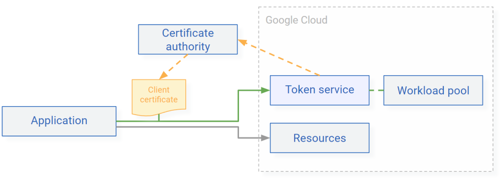

# Deploy the Token Service

This article describes how you can deploy the token service on Cloud Run
and configure it so that it can authenticate clients using mutual TLS (mTLS).

{ width="570" }

???+ info "Before you begin"

    To follow the instructions in this guide, you need the following:

    *   [ ] An X.509 certificate authority that can issue client certificates. 
    *   [ ] The CA certificate of the certificate authority.
    *   [ ] A CA-issued client certificate that you can use to test the deployment.

## Prepare your Google Cloud project

1.  Select or create a Google Cloud project. 
 
    [Open Project selector](https://pantheon.corp.google.com/projectselector2/home/dashboard){ .md-button }

2.  Enable billing for your project. 
 
    [Open Billing](https://support.google.com/cloud/answer/6293499#enable-billing){ .md-button }

3.  In the Google Cloud console, enable the Cloud Run, Resource Manager, and IAM Credentials APIs. 
 
    [Enable the APIs](https://console.cloud.google.com/flows/enableapi?apiid=iamcredentials.googleapis.com,cloudresourcemanager.googleapis.com,run.googleapis.com){ .md-button }

4.  Open Cloud Shell. 
 
    [Open Cloud Shell](https://console.cloud.google.com/?cloudshell=true){ .md-button }

5.  Set an environment variable to contain your [project ID](https://cloud.google.com/resource-manager/docs/creating-managing-projects :octicons-link-external-16:): 
 
        gcloud config set project PROJECT_ID 

    Replace `PROJECT_ID` with the ID of your project. 

6.  Create a service account for the the Token Service application:

        SERVICE_ACCOUNT=$(gcloud iam service-accounts create token-service --display-name "Token Service" --format "value(email)") 

    You later use this service account and attach it to the Cloud Run service. 

7.  Grant the service account permission the _Service Account Token Creator_ 
    (`roles/iam.serviceAccountTokenCreator`) role on itself so that the Token Service 
    application can use the service account to sign JSON Web Tokens: 
 
        gcloud iam service-accounts add-iam-policy-binding $SERVICE_ACCOUNT \
            --member "serviceAccount:$SERVICE_ACCOUNT" \
            --role "roles/iam.serviceAccountTokenCreator" \
            --condition None

## Deploy the application

You now deploy the Token Service application to Cloud Run:

1.  Create a new workload identity pool: 
 
        POOL_ID=POOL 
        gcloud iam workload-identity-pools create $POOL_ID \
            --location="global" \
            --display-name="NAME" 

    Replace the following: 

    *   `POOL`: pool ID. Use an ID that describes the type of workloads or devices that you’re authenticating, for example altostrat-widgets.
    *   `NAME`: the display name, for example Altostrat IoT widgets. 

2.  In Cloud Shell, select a region to deploy to: 
 
        gcloud config set run/region REGION 

    Replace `REGION` with a region that supports Cloud Run.
    
3.  Clone the GitHub repository and switch to the latest branch: 
 
        git clone https://github.com/GoogleCloudPlatform/iam-federation-tools.git
        cd iam-federation-tools/token-service
        git checkout latest 

4.  Build the application and push the container image to Container Registry: 
 
        PROJECT_ID=$(gcloud config get-value core/project) 
 
        docker build -t gcr.io/$PROJECT_ID/token-service:latest . 
        docker push gcr.io/$PROJECT_ID/token-service:latest

5.  Create a configuration file for the Token Service application: 
 
        PROJECT_NUMBER=$(gcloud projects describe $PROJECT_ID --format 'value(projectNumber)')
        REGION=$(gcloud config get-value run/region)

        cat << EOF > app.yaml

        apiVersion: serving.knative.dev/v1
        kind: Service
        metadata:
          name: token-service
          namespace: $PROJECT_NUMBER
          labels:
            cloud.googleapis.com/location: $REGION
          annotations:
            run.googleapis.com/ingress: internal-and-cloud-load-balancing
        spec:
          template:
            spec:
              serviceAccountName: $SERVICE_ACCOUNT
              containers:
              - image: gcr.io/$PROJECT_ID/token-service:latest
                env:
                - name: AUTH_FLOWS
                  value: "xlb-mtls-client-credentials"
                - name: TOKEN_VALIDITY
                  value: "5"
                - name: WORKLOAD_IDENITY_PROJECT_NUMBER
                  value: "$PROJECT_NUMBER"
                - name: WORKLOAD_IDENITY_POOL_ID
                  value: "$POOL_ID"
                - name: WORKLOAD_IDENITY_PROVIDER_ID
                  value: "token-service"
                - name: MTLS_HEADER_CLIENT_ID
                  value: "X-Client-Cert-Hash"

        EOF

    In this configuration file, you can customize the values of the variables. For a 
    list of settings, see [Configuration](token-service-configuration.md). 

6. Deploy the application: 
 
        gcloud run services replace app.yaml 

7.  [Allow the application to handle authentication itself :octicons-link-external-16:](https://cloud.google.com/run/docs/securing/managing-access) 
    instead of requiring clients to authenticate with Google first: 
 
        gcloud run services add-iam-policy-binding token-service \
            --member="allUsers" \
            --role="roles/run.invoker"

### Configure a load balancer

You now deploy a load balancer.

1.  Enable the Compute Engine, Certificate Manager, and Network Security APIs. 
 
    [Enable the APIs](https://console.cloud.google.com/flows/enableapi?apiid=compute.googleapis.com,certificatemanager.googleapis.com,networksecurity.googleapis.com){ .md-button }

2.  Reserve a [static external IP address :octicons-link-external-16:](https://cloud.google.com/compute/docs/ip-addresses/reserve-static-external-ip-address) 
    for the load balancer: 
 
        gcloud compute addresses create token-service-ip --global 

3.  Create a [managed SSL certificate :octicons-link-external-16:](https://cloud.google.com/load-balancing/docs/ssl-certificates/google-managed-certs) 
    for the load balancer: 
 
        PUBLIC_FQDN=FQDN 
        gcloud compute ssl-certificates create token-service \
          --domains $PUBLIC_FQDN \
          --global 

    where `FQDN` is the public, fully qualified domain name (FQDN) that you want to use, for example
    `token-service.example.com`.
    
4.  Look up the IP address of the load balancer: 
 
        gcloud compute addresses describe token-service-ip \
          --global \
          --format "value(address)"

5.  Create a DNS A record in your public DNS zone that points to the IP address of the load balancer. 
    The fully qualified name of the DNS record must match the name that you used for the SSL certificate. 
 
    !!! Note
        It can take multiple minutes or hours for the new DNS record to propagate. During this time, the managed SSL certificate can't be used. For details, see [Troubleshooting Google-managed certificates :octicons-link-external-16:](https://cloud.google.com/load-balancing/docs/ssl-certificates/troubleshooting#troubleshooting_google-managed_certificates).

5. Create a [backend service :octicons-link-external-16:](https://cloud.google.com/load-balancing/docs/backend-service): 
 
        gcloud compute backend-services create token-service-backend \
          --load-balancing-scheme=EXTERNAL \
          --global 

6.  Create a [serverless network endpoint group :octicons-link-external-16:](https://cloud.google.com/load-balancing/docs/negs/serverless-neg-concepts)
    for the Cloud Run service and connect it to the backend service: 
 
        gcloud compute network-endpoint-groups create token-service \
          --region $(gcloud config get-value run/region) \
          --network-endpoint-type=serverless \
          --cloud-run-service token-service 
        gcloud compute backend-services add-backend token-service-backend \
          --global \
          --network-endpoint-group token-service \
          --network-endpoint-group-region $(gcloud config get-value run/region) 

7.  Create a load balancer frontend that uses the external IP address and forwards 
    traffic to the backend service: 
 
        gcloud compute url-maps create token-service \
          --default-service token-service-backend 
        gcloud compute target-https-proxies create token-service-proxy \
          --ssl-certificates token-service \
          --url-map token-service 
        gcloud compute forwarding-rules create token-service-https \
          --load-balancing-scheme EXTERNAL \
          --address token-service-ip \
          --target-https-proxy token-service-proxy \
          --global \
          --ports=443

1.  Use the load balancer’s public FQDN and register the Token Service application as a 
    workload identity pool provider: 
 
        gcloud iam workload-identity-pools providers create-oidc token-service \
            --location="global" \
            --workload-identity-pool=$POOL_ID \
            --issuer-uri="https://$PUBLIC_FQDN/" \
            --attribute-mapping="google.subject=assertion.client_id, attribute.client_x5_spiffe=assertion.client.x5_spiffe, attribute.client_x5_dnssan=assertion.client.x5_dnssan, attribute.client_x5_urisan=assertion.client.x5_urisan, attribute.client_x5_sha256=assertion.client.x5_sha256, attribute.client_x5_serial=assertion.client.x5_serial"
            
2.  Perform an HTTP request to the Token Service to verify that it has been deployed successfully: 
 
        curl -L https://$PUBLIC_FQDN | jq 
 
    The output is the OIDC metadata of the Token Service: 
 
        {
          "issuer": "https://token-service.example.com/",
          "authorization_endpoint": "https://token-service.example.com/token",
          "token_endpoint": "https://token-service.example.com/token",
          "jwks_uri": "https://www.googleapis.com/service_accounts/v1/metadata/jwk/token-service@project.iam.gserviceaccount.com",
          "response_types_supported": [
            "none"
          ],
          "grant_types_supported": [
            "client_credentials"
          ],
          "subject_types_supported": [
            "none"
          ],
          "id_token_signing_alg_values_supported": [
            "RS256"
          ],
          "token_endpoint_auth_methods_supported": [
            "tls_client_auth"
          ]
        }

    If you see an SSL-related error message instead, then provisioning the certificate might still be in progress.
    For details, see [Troubleshooting Google-managed certificates :octicons-link-external-16:](https://cloud.google.com/load-balancing/docs/ssl-certificates/troubleshooting#troubleshooting_google-managed_certificates).

### Configure mTLS

You now configure the load balancer to verify mTLS certificates:

1.  Copy the PEM-formatted certificates of your certificate authority:

    === "Root CA"
    
        1.  Copy the PEM-formatted root certificate of your certificate authority to a file named `ca.cer`.  

    === "Intermediate CA"
    
    
        1.  Copy the PEM-formatted root certificate of your certificate authority to a file named `ca.cer`.  
        2.  Copy the PEM-formatted intermeduate CA certificate to a file named `intermediate-ca.cer`.  

    
    !!!Note
        The contents of the `.cer` files must start with `-----BEGIN CERTIFICATE-----`. 

2.  Create a [TrustConfig resource :octicons-link-external-16:](https://cloud.google.com/certificate-manager/docs/trust-configs)
    in Certificate Manager: 
 
    === "Root CA"
 
        Create a TrustConfig resource that contains your CA root certificate:
        
            cat << EOF > token-service-ca.yaml
            name: token-service-ca
            trustStores:
            - trustAnchors:
               - pemCertificate: "$(cat ca.cer | sed 's/^[ ]*//g' | tr '\n' $ | sed 's/\$/\\n/g')"
            EOF

            gcloud beta certificate-manager trust-configs import token-service-ca \
              --source token-service-ca.yaml

            gcloud beta certificate-manager trust-configs import token-service-ca \
                --source token-service-ca.yaml

 
    === "Intermediate CA"
 
        Create a TrustConfig resource that contains both, your CA root and intermediate CA certificate:
        
            cat << EOF > token-service-ca.yaml
            name: token-service-ca
            trustStores:
            - trustAnchors:
               - pemCertificate: "$(cat ca.cer | sed 's/^[ ]*//g' | tr '\n' $ | sed 's/\$/\\n/g')"
              intermediateCas:
               - pemCertificate: "$(cat intermediate-ca.cer | sed 's/^[ ]*//g' | tr '\n' $ | sed 's/\$/\\n/g')"
            EOF

            gcloud beta certificate-manager trust-configs import token-service-ca \
              --source token-service-ca.yaml

            gcloud beta certificate-manager trust-configs import token-service-ca \
                --source token-service-ca.yaml

3. Create a TLS policy that instructs the load balancer to validate client certificates by using the 
    TrustConfig resource that you created in the previous step: 
 
        cat << EOF > token-service-mtls.yaml
        name: token-service-mtls
        mtlsPolicy:
          clientValidationMode: ALLOW_INVALID_OR_MISSING_CLIENT_CERT
          clientValidationTrustConfig: projects/$PROJECT_ID/locations/global/trustConfigs/token-service-ca
        EOF

        gcloud beta network-security server-tls-policies import token-service-mtls \
            --source token-service-mtls.yaml \
            --location global

    !!!note
        You must use validation mode `ALLOW_INVALID_OR_MISSING_CLIENT_CERT` so that workload 
        identity federation can access the Token Service API. 

8.  Update the load balancer’s target proxy configuration so that it uses the new TLS policy: 
 
        { 
          gcloud compute target-https-proxies export token-service-proxy --global;
          echo "serverTlsPolicy: //networksecurity.googleapis.com/projects/$PROJECT_ID/locations/global/serverTlsPolicies/token-service-mtls" 
        } > token-service-proxy.yaml

        gcloud compute target-https-proxies import token-service-proxy \
          --global \
          --source token-service-proxy.yaml \
          --quiet

9.  Update the load balancer’s backend configuration so that it propagates information from 
    client certificates in [custom request headers :octicons-link-external-16:](https://cloud.google.com/load-balancing/docs/https/custom-headers-global): 

        gcloud compute backend-services update token-service-backend \
          --global \
          --enable-logging \
          --logging-sample-rate=1 \
          --custom-request-header='X-Client-Cert-Present: {client_cert_present}' \
          --custom-request-header='X-Client-Cert-Chain-Verified:{client_cert_chain_verified}' \
          --custom-request-header='X-Client-Cert-Error:{client_cert_error}' \
          --custom-request-header='X-Client-Cert-Hash:{client_cert_sha256_fingerprint}' \
          --custom-request-header='X-Client-Cert-Serial-Number:{client_cert_serial_number}' \
          --custom-request-header='X-Client-Cert-SPIFFE:{client_cert_spiffe_id}' \
          --custom-request-header='X-Client-Cert-URI-SANs:{client_cert_uri_sans}' \
          --custom-request-header='X-Client-Cert-DNSName-SANs:{client_cert_dnsname_sans}' \
          --custom-request-header='X-Client-Cert-Valid-Not-Before:{client_cert_valid_not_before}' \
          --custom-request-header='X-Client-Cert-Valid-Not-After:{client_cert_valid_not_after}'

    It might take up to 1 hour for changes to take effect.

The token service is now ready to [authenticate clients](token-service-authenticate-clients-mtls.md).

## What's next

*   Read [how to authenticate clients using the token service](token-service-authenticate-clients-mtls.md)
*   Protect the token service using 
    [Google Cloud Armor security policies :octicons-link-external-16:](https://cloud.google.com/armor/docs/configure-security-policies)
    