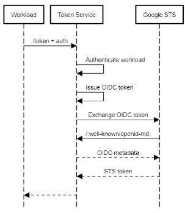
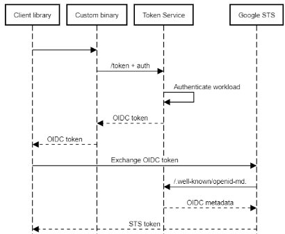

# Token Service

The Token Service is an application that lets clients exchange custom credentials against an ID token
that is suitable for workload identity federation. It acts as an Open ID Connect identity provider, 
and clients can authenticate using different authentication flows to obtain an ID token that asserts their identity. 

The service supports the following authentication flows:

*   `xlb-mtls-client-credentials`: This flow lets clients authenticate
    using mutual TLS (mTLS) and uses the
    [mTLS feature of the Google Cloud load balancer :octicons-link-external-16:](https://cloud.google.com/load-balancing/docs/mtls).
*   Custom: You can add additional, custom authentication flows by extending the
    the [`ClientCredentialsFlow`](https://github.com/GoogleCloudPlatform/iam-federation-tools/blob/master/token-service/src/main/java/com/google/solutions/tokenservice/oauth/ClientCredentialsFlow.java)
    base class.

When registered as a [as a workload identity pool provider :octicons-link-external-16:](https://cloud.google.com/iam/docs/manage-workload-identity-pools-providers),
clients can then use the ID token and exchange it against short-lived Google credentials by using the 
[Google STS API :octicons-link-external-16:](https://cloud.google.com/iam/docs/reference/sts/rest).

## Service

The Token Service uses Quarkus, CDI, and JAX-RS and is designed to run on Cloud Run. It exposes two endpoints:

*   `/token`: An OAuth client credentials flow-compatible endpoint that lets workloads authenticate and obtain an OIDC token.
*   `/.well-known/openid-metadata`: Returns an OIDC-compliant metadata document that lets the token-service present 
    itself as an identity provider towards workload identity federation.

After authenticating a workload, the `/token` endpoint does the following to issue an OIDC token:

1.  Creates a JWT that reflects the claims provided in the input credential (for example, X.509 CN, SpiffeID, etc.) and asserts itself as issuer (iss).
2.  Uses the `signJwt` method of its attached service account to sign the JWT.

## Client-side usage

Workloads can use the token-service in two ways:

1.  **Directly**: A workload can interact with the token-service directly to authenticate 
    and obtain an STS token and/or service account access token. In this scenario, the workload 
    never needs to interact with the Google STS and the fact that the token-service uses workload
    identity federation is hidden from the workload.

    
    
    This approach requires custom logic in the workload.

2.  **Via pluggable auth**: A workload that uses client libraries or gcloud can use executable-sourced
    credentials to invoke a custom binary or script. This binary or script authenticates to the token 
    service, obtains an OIDC token, and passes it back to the client library. The client library, using
    its built-in workload identity federation support, then exchanges the OIDC token against an STS 
    token and/or service account access token. 

    

    This approach requires a custom script or binary, but no code changes in the workload.
