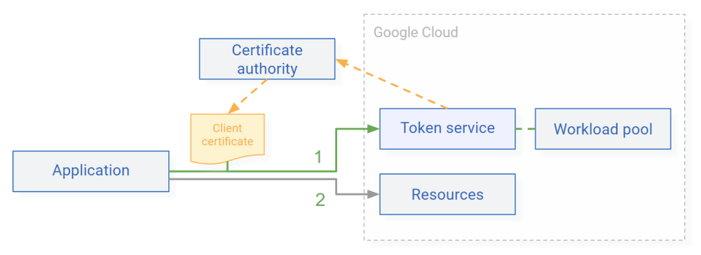

# Authenticate workloads and devices

Before an IoT device or on-premises workload can access Google Cloud APIs, it needs to authenticate. 
One way to do this is to use service account keys. However, service account keys 
[can leak :octicons-link-external-16:](https://cloud.google.com/iam/docs/best-practices-for-managing-service-account-keys#credential-leakage) 
and need to be [rotated periodically :octicons-link-external-16:](https://cloud.google.com/iam/docs/best-practices-for-managing-service-account-keys#rotate-keys), 
which can be a maintenance and security burden.

You can eliminate this burden by using [workload identity federation :octicons-link-external-16:](https://cloud.google.com/iam/docs/workload-identity-federation):
Workload identity federation allows devices or workloads to exchange existing credentials against short-lived 
access tokens. This means that you don't have to manage service account keys, which can help to improve security.

Workload identity federation supports certain types of credentials, including OIDC tokens and SAML assertions. 
By combining workload identity federation with a token broker, you can add support for other types 
of credentials, including X.509 client certificates.

For example, if you're already using an X.509 public key infrastructure (PKI) to issue client certificates to devices 
or workloads, you can use a token broker service to let clients authenticate using 
their existing client certificates and mutual TLS.

## Token Service

The Token Service is an open-source example implementation of a token broker that extends workload
identity federation by adding support for additional authentication flows:

*   `xlb-mtls-client-credentials`: This flow lets clients authenticate
    using mutual TLS (mTLS).
    
    { width="570" }

    Clients use mTLS to authenticate to the token broker. Using the identity
    information from the client certificate, the token broker can then issue
    different types of credentials to the client, including short-lived Google credentials.

*   Custom flows: You can add additional, custom authentication flows by extending the
    the [`ClientCredentialsFlow`](https://github.com/GoogleCloudPlatform/iam-federation-tools/blob/master/token-service/src/main/java/com/google/solutions/tokenservice/oauth/ClientCredentialsFlow.java)
    base class.

## Implementation

The Token Service ia a Java application that uses Quarkus, CDI, and JAX-RS and is designed to run on Cloud Run. 
It exposes two endpoints:

*   `/token`: An OAuth client credentials flow-compatible endpoint that lets workloads authenticate and obtain an OIDC token.
*   `/.well-known/openid-metadata`: An OIDC-compliant metadata endpoint that lets the token service present 
    itself as an identity provider towards workload identity federation.

To issue ID tokens, the token service uses the 
[`signJwt` :octicons-link-external-16:](https://cloud.google.com/iam/docs/reference/credentials/rest/v1/projects.serviceAccounts/signJwt)
method of its attached service account. By using this API to sign tokens, the application avoids having to
maintain any encryption keys.

## Usage

For a list of examples that show how clients can authenticate to the token service, see 
[Authenticate clients](token-service-authenticate-clients-mtls.md).

# What's next

*   Learn how you can [deploy the token service](token-service-deployment.md)
*   See how [clients can authenticate to the token service](token-service-authenticate-clients-mtls.md)