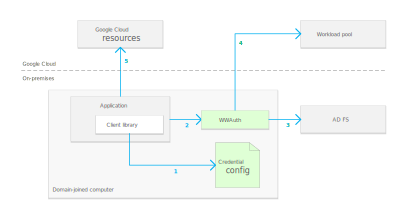
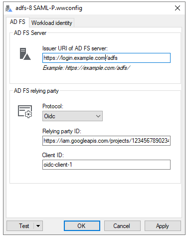
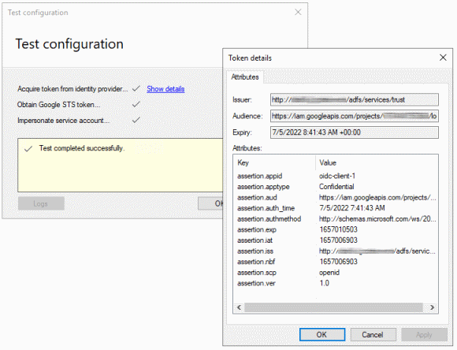

# Workload Authenticator for Windows

Workload Authenticator for Windows (WWAuth) lets Windows applications authenticate to Google Cloud using their 
Active Directory Kerberos credentials. Using WWAuth is an alternative to using service account keys
and doesn't require you to manage and store any secrets or keys.

WWAuth acts as a plugin for `gcloud`, `terraform`, and other applications
that use [Google Cloud client libraries :octicons-link-external-16:](https://cloud.google.com/apis/docs/cloud-client-libraries)
and requires no code changes in the application.

## Authentication

To let Windows application authenticate using their existing Active Directory credentials, WWAuth combines
[integrated windows authentication :octicons-link-external-16:](https://docs.microsoft.com/en-us/aspnet/web-api/overview/security/integrated-windows-authentication)
(IWA) and [workload identity federation :octicons-link-external-16:](https://cloud.google.com/iam/docs/workload-identity-federation):

1.  You configure an application to use WWAuth by pointing the environment variable
    `GOOGLE_APPLICATION_CREDENTIALS` to an WWAuth-enabled credential configuration file.
1.  The credential configuration file instructs the client library (which is built into the application) to 
    invoke WWAuth every time it needs to authenticate to Google Cloud. This mechanism is 
	called [executable-sourced credentials :octicons-link-external-16:](https://google.aip.dev/auth/4117).
1.  When invoked by the client library, WWAuth uses the application's Kerberos credentials to authenticate to an
    Active Directory Federation Services (AD FS) instance, and returns an OAuth token
    or SAML assertion back to the client library.
1.  The client library exchanges the token or assertion against short-lived Google
    credentials by using workload identity federation.
1.  The application uses the short-lived Google Credentials to access resources
    on Google Cloud.

## Configuration

WWAuth includes a user interface that lets you create and edit a WWAuth-enabled credential 
configuration file:

The user interface also includes the option to test the configuration and check for common
misconfigurations:

